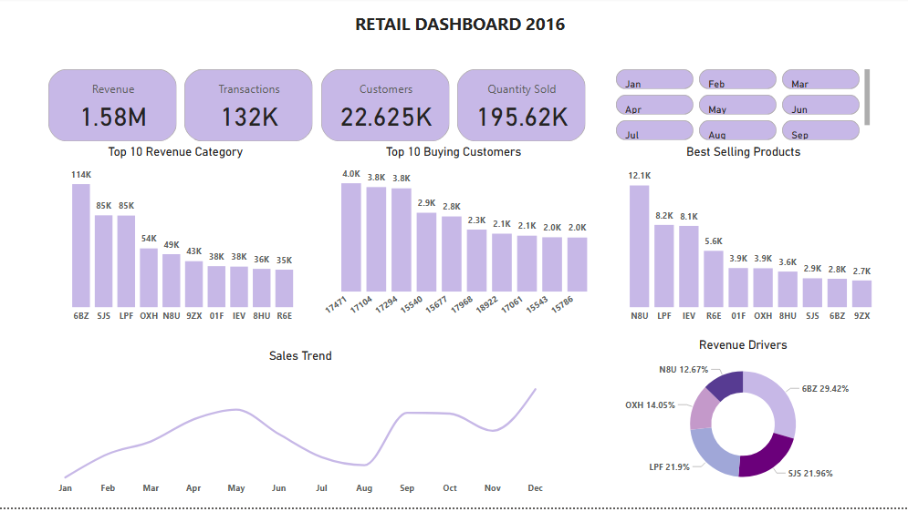
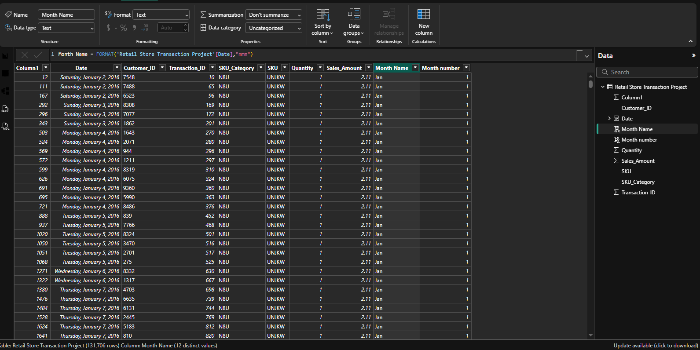
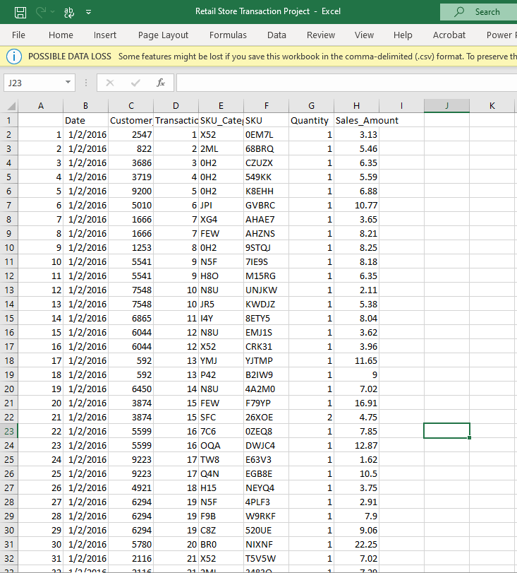
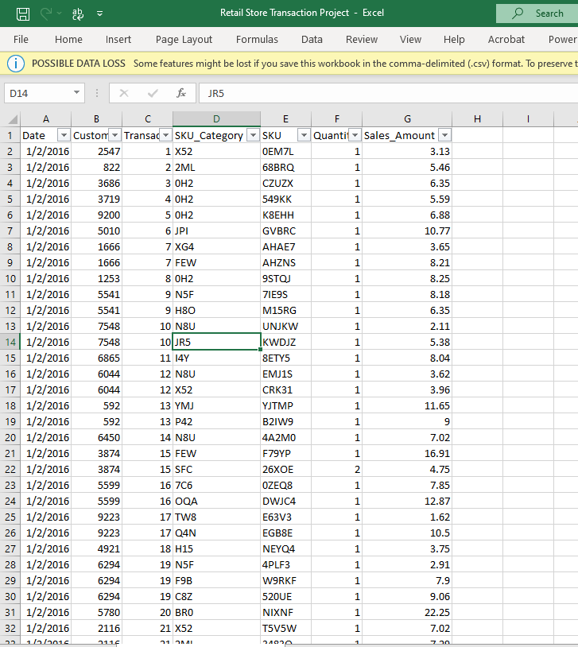

# Revenue-Growth-Monitoring-System-for-Chuks-Retail-Store
A project analyzing historical data of Chuks medium-sized retail store to find growth opportunities.
---
.jpeg)

## Table of Content

- [Project Overview](#Project-Overview)
- [Dashboard Overview](#Dashboard-Overview)
- [Key Insights](#Key-Insights)
- [Business Recommendations](#Business-Recommendations)
- [Tools and Technologies](#Tools-and-Technologies)
- [Conclusion](#Conclusion)

## Project Overview

  
Chuks is a successful retail business owner who has built a profitable store over the past few years. His first store has grown steadily, generating strong revenue, loyal customers, and consistent product demand.

Now, Chuks is planning to expand his business by opening a second store in a nearby location. However, instead of starting from scratch and making costly trial-and-error decisions, he wants to learn from the performance of his existing store.

This analysis was carried out to answer a key business question:

> **“How can Chuks replicate the success of his current store and fast-track growth in new locations?”**

By analyzing sales performance, customer behavior, product trends, and seasonal patterns from the existing store, this project provides actionable insights that can guide:
- What products to prioritize in the new store
- Which customers drive the most value
- When to expect peak and low sales periods
- How revenue is actually being generated in the business

> **The goal is to turn historical store data into a **blueprint for scaling successfully**, reducing risk and improving decision-making for expansion.**
---

## Dashboard Overview

### Key Performance Indicators (KPIs)
**Total Revenue:** 1.58M  
**Total Transactions:** 132K  
**Total Customers:** 22.6K  
**Total Quantity Sold:** 195.6K  

---

## Key Insights

### Revenue Performance
- Total revenue stands at **1.58M**, indicating strong overall sales performance.
- A small number of product categories contribute the majority of revenue.

---

### Top Revenue Categories
- The highest-performing category generates **114K** in revenue.
- Other top categories range between **85K – 35K**.

**Insight:** Revenue is concentrated in a few key categories.

**Recommendation:** Focus marketing and inventory investment on top-performing categories.

---

### Customer Analysis
- Top customers contribute between **2.0K – 4.0K** each.
- Indicates a strong base of repeat customers.

**Recommendation:** Introduce loyalty programs to improve retention and lifetime value.

---

### Best-Selling Products
- Leading product generates **12.1K sales**, significantly higher than others.
- A small group of products dominates overall sales.

**Recommendation:** Ensure consistent stock availability for top products and bundle slow-moving items.

---

### Sales Trend Analysis
- Sales show seasonal variation:
  - Mid-year dip (June–August)
  - Strong peak toward November–December

**Insight:** Business is highly seasonal.

**Recommendation:** Increase inventory and marketing efforts before peak seasons.

---

### Revenue Drivers
Top Customer contributors to revenue include:
- **6BZ – 29.42%**
- **SJS – 21.96%**
- **LPF – 21.9%**

**Insight:** Over 70% of revenue comes from a few key drivers.

**Recommendation:** Diversify product mix to reduce dependency risk.

---

## Business Recommendations
- Prioritize high-performing product categories
- Improve customer retention through loyalty programs
- Optimize inventory for best-selling products
- Prepare for seasonal demand spikes (Q4 focus)
- Diversify revenue streams across categories

---

## Tools and Technologies
1- Power BI / Excel (Data Transformation & Visualization)
  
  
2- Data Cleaning 

Raw Data

           

Clean Data

3- Dashboard Design & Storytelling

---

## Conclusion

To successfully scale the performance of the new store, it is critical that Chuks does not rely on intuition alone but adopts a data-driven expansion strategy.

**Immediate Action Steps:**
- Prioritize stocking the top-performing product categories and best-selling items identified in this analysis  
- Focus marketing efforts on the highest revenue-generating segments (6BZ, SJS, LPF)  
- Implement customer retention strategies targeting top-value customers  
- Align inventory planning with identified seasonal demand patterns, especially ahead of Q4 peak sales  
- Use this dashboard as a **benchmark model for all future store locations**

By executing these insights, Chuks can significantly reduce the risk of expansion failure and ensure the new store achieves profitability faster, with fewer trial-and-error cycles.

**In summary:**  
> *Let data, not assumptions, drive expansion decisions.*
---

**Back to Top**
### [Table of Content](#Table-of-Content)
